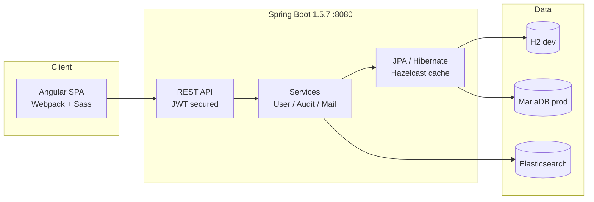

<div align="right">


</div>

# RSSLive

**A full-stack web application scaffold for a live RSS experience — Spring Boot backend, Angular frontend, generated with JHipster 4.10.2 and ready to build on.**

> **Why should I care?** This is the boring-but-correct foundation: JWT auth, user management, auditing, metrics, and a production database config — all wired and working out of the box. Clone it, run two commands, and you have a running monolith to grow your RSS features on instead of a blank `pom.xml`.

## Features

- **🔐 Complete auth** — JWT-based login, user registration, password reset, role-based access (admin/user)
- **📊 Built-in ops** — metrics, health checks, auditing, and user-activity tracking via the JHipster admin UI
- **🔍 Search-ready** — Elasticsearch integration for full-text search
- **🗄️ Real database story** — H2 on disk for dev, MariaDB for production
- **⚡ Cached** — Hazelcast Hibernate second-level cache
- **🖥️ Modern client** — Angular frontend with Webpack build, Sass, and hot-reload dev server

## Architecture



## Quick start

```bash
./mvnw          # backend on :8080 (terminal 1)
yarn start       # frontend dev server with hot reload (terminal 2)
```

Sign in with `admin` / `admin` (or `user` / `user`).

## Config

| Concern | Dev | Prod |
|---|---|---|
| Database | H2 (disk) | MariaDB |
| Search | Elasticsearch | Elasticsearch |
| Cache | Hazelcast | Hazelcast |
| Service discovery | Eureka | Eureka |
| Packaging | `./mvnw` | `./mvnw -Pprod package` |

Server port: `8080`. The JWT secret lives in `.yo-rc.json` — rotate it before any public deployment.

## Dev / contributing

Generated with [JHipster 4.10.2](http://www.jhipster.tech/documentation-archive/v4.10.2). Standard Maven + Yarn workflow: `./mvnw` for the backend, `yarn start` / `yarn test` for the client. Entity scaffolding via `yo jhipster:entity` if you add the generator.

## License + security

No license file is currently declared in this repository — treat as all-rights-reserved until one is added.

Security notes: this scaffold ships with **default credentials** (`admin`/`admin`, `user`/`user`) and a **committed JWT secret** (`.yo-rc.json`). Change both before exposing the app to any network. Dependencies are from 2017 (Spring Boot 1.5.x, Angular 4) — run `yarn audit` / dependency checks and upgrade before production use.
